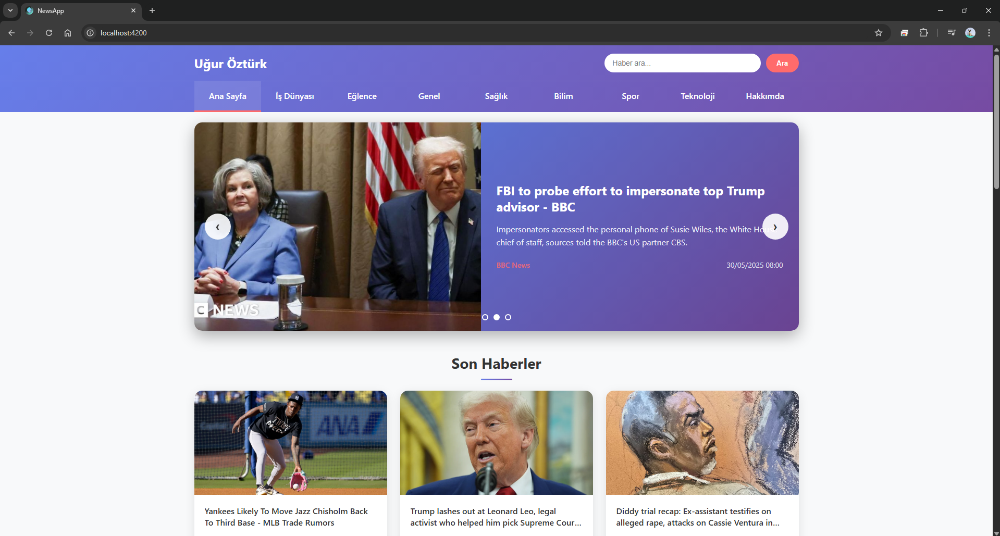
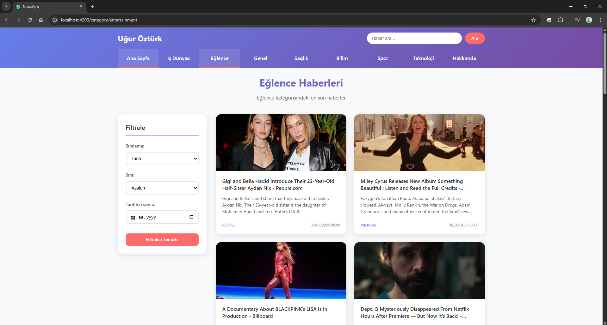
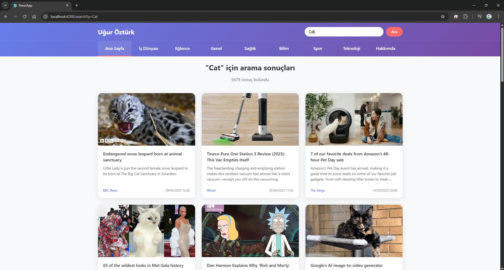
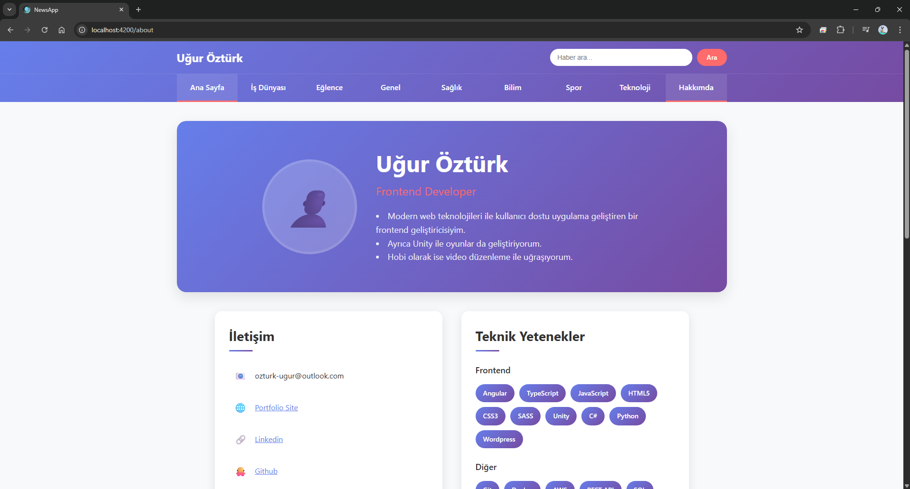
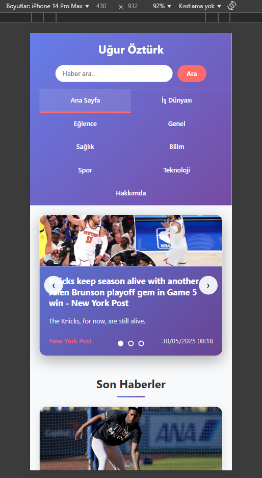

# 📰 Angular News Website

Modern ve responsive haber portalı uygulaması. NewsAPI kullanarak gerçek zamanlı haber verileri çeker ve kullanıcı dostu bir arayüzle sunar.

## 🎯 Özellikler

### ✨ Ana Özellikler
- 📰 **Ana Sayfa**: Slider ile öne çıkan haberler ve haber grid'i
- 🏷️ **Kategori Sayfaları**: 7 farklı kategori (İş Dünyası, Eğlence, Genel, Sağlık, Bilim, Spor, Teknoloji)
- 🔍 **Arama Fonksiyonu**: Header'da bulunan arama kutusu
- 📄 **Sayfalama**: Tüm sayfalarda pagination desteği
- 👤 **Hakkımda Sayfası**: CV tarzında kişisel portfolio
- 📱 **Responsive Design**: Mobil ve tablet uyumlu

### 🛠️ Teknik Özellikler
- ⚡ Angular 20 Standalone Components
- 🔄 RxJS ile reactive programming
- 🎨 Modern CSS Grid ve Flexbox layout
- 🌐 CORS proxy konfigürasyonu
- 📡 NewsAPI.org entegrasyonu
- 🎭 Loading states ve error handling

## 📸 Ekran Görüntüleri

### Ana Sayfa


### Kategori Sayfası  


### Arama Sonuçları


### Hakkımda Sayfası


### Mobil Görünüm


## 🛠️ Teknolojiler

### Frontend
- **Angular 20.0.0** - Ana framework
- **TypeScript** - Programlama dili
- **RxJS** - Reactive programming
- **CSS3** - Styling (Grid, Flexbox, Animations)
- **HTML5** - Markup

### API & Data
- **NewsAPI.org** - Haber veri kaynağı
- **HTTP Client** - API çağrıları
- **CORS Proxy** - Cross-origin sorunları için

### Development Tools
- **Angular CLI** - Development server ve build
- **npm** - Package management
- **Git** - Version control

## ⚙️ Kurulum

### Ön Gereksinimler
- Node.js (v18+)
- npm veya yarn
- Angular CLI (`npm install -g @angular/cli`)

### Kurulum Adımları

1. **Repository'yi klonlayın:**
```bash
git clone https://github.com/Reashi/news-app.git
cd news-app
```

2. **Bağımlılıkları yükleyin:**
```bash
npm install
```

3. **NewsAPI key'inizi ekleyin:**
   - [NewsAPI.org](https://newsapi.org) adresinden ücretsiz API key alın
   - `src/app/services/news.ts` dosyasında `apiKey` değişkenini güncelleyin

4. **Development server'ı başlatın:**
```bash
npm run start:proxy
```

5. **Tarayıcıda açın:**
   - http://localhost:4200 adresine gidin

## 📁 Proje Yapısı

```
news-app/
├── src/
│   ├── app/
│   │   ├── components/
│   │   │   ├── header/          # Navigation ve arama
│   │   │   └── slider/          # Ana sayfa slider
│   │   ├── pages/
│   │   │   ├── home/            # Ana sayfa
│   │   │   ├── category/        # Kategori sayfaları
│   │   │   ├── search/          # Arama sonuçları
│   │   │   └── about/           # Hakkımda sayfası
│   │   ├── services/
│   │   │   └── news.ts          # NewsAPI servisi
│   │   └── app.routes.ts        # Route konfigürasyonu
│   ├── styles.css               # Global stiller
│   └── main.ts                  # Ana bootstrap dosyası
├── proxy.conf.json              # CORS proxy ayarları
└── package.json                 # Dependencies
```

## 🔧 Özellikler Detayı

### Slider Component
- Otomatik geçiş (5 saniye)
- Manual navigasyon (ok tuşları)
- Dot navigation
- İlk 3 haber gösterimi

### Kategori Filtreleme
- Sol sidebar ile filtreleme
- Tarih ve başlık sıralaması
- Tarih aralığı filtreleme
- Filtreleri temizleme

### Arama Sistemi
- Header'da global arama kutusu
- Enter ile arama
- URL query parameter desteği
- Sonuç sayısı gösterimi

### Responsive Design
- Mobile-first yaklaşım
- Tablet ve mobil optimizasyonu
- CSS Grid ile adaptive layout
- Touch-friendly interface

## 🚨 Bilinen Sorunlar

### CORS Sorunu
NewsAPI ücretsiz planı sadece localhost'tan isteklere izin verir. Production deployment için:

### Çözümler
1. **Kendi Backend Sunucusu** (Önerilen - CORS bypass)
2. **Alternatif API'lar** (The Guardian, NYT vb.)
3. **NewsAPI Pro Plan** (Production domain'i whitelist)

## 📦 Build ve Deploy

### Development
```bash
npm run start:proxy    # Proxy ile development server
```

### Production Build
```bash
ng build --configuration production
```

## 🤝 Katkıda Bulunma

1. Fork yapın
2. Feature branch oluşturun (`git checkout -b feature/amazing-feature`)
3. Commit yapın (`git commit -m 'Add amazing feature'`)
4. Branch'inizi push edin (`git push origin feature/amazing-feature`)
5. Pull Request açın

## 📝 License

Bu proje MIT License altında lisanslanmıştır. Detaylar için [LICENSE](LICENSE) dosyasını inceleyin.

## 👨‍💻 Geliştirici

**Uğur Öztürk**
- Portfolio: [reashi.github.io](https://reashi.github.io)
- LinkedIn: [linkedin.com/in/reashi](https://www.linkedin.com/in/reashi/)
- GitHub: [github.com/Reashi](https://github.com/Reashi)
- Email: ozturk-ugur@outlook.com

## 🙏 Teşekkürler

- [NewsAPI.org](https://newsapi.org) - Haber verisi için
- [Angular Team](https://angular.io) - Harika framework için
- [GitHub Pages](https://pages.github.com) - Ücretsiz hosting için

---

⭐ Bu projeyi beğendiyseniz star vermeyi unutmayın!

